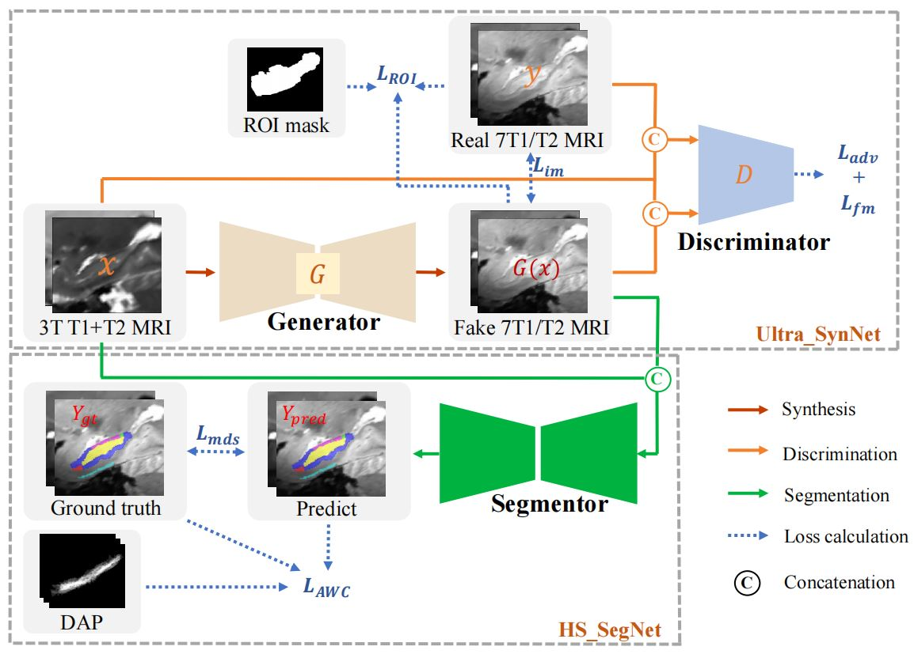

# Syn_SegNet :A Joint Deep Neural Network for Ultrahigh-Field 7T MRI Synthesis and Hippocampal Subfield Segmentation in Routine 3T MRI


This is our implementation of an end-to-end neural network segmentation framework based on the TensorFlow framework, which improves the segmentation accuracy on routine 3T MRI by synthesizing 7T-like MRI.



The paper can be found in [there](https://ieeexplore.ieee.org/abstract/document/10218394/algorithms#algorithms) for IEEE Journal of Biomedical and Health Informatics.


## Prerequisites
- Linux or Windows
- Python 3
- CPU or NVIDIA GPU
- TensorFlow 1.15


##Dataset
This study used [PAIRED 3T-7T HIPPOCAMPAL SUBFIELD DATASET](https://ieee-dataport.org/documents/paired-3t-7t-hippocampal-subfield-dataset) (To be uploaded)collected from the Beihang University.

In our implementation, the raw dataset folder should be organized as follows:
```
./DATASET/
  ├── ImageNIfTI/
      ├── 01/
           ├── 3t_t1_s01.nii.gz/
           ├── 3t_t2_s01.nii.gz/
           ├── 7t_t1_s01.nii.gz/
           ├── 7t_t2_s01.nii.gz/
       ├── 02/
           ├── 3t_t1_s01.nii.gz/
           ├── 3t_t2_s01.nii.gz/
           ├── 7t_t1_s01.nii.gz/
           ├── 7t_t2_s01.nii.gz/
       ...
 ```
After executing the three Linux programs 1st_denoise_n4biascorrection.sh, 2nd_truncate_rescale_hismatch.sh and 3rd_registration_hippocampusextraction_bet.sh in sequence in the preprocess folder, the following usable preprocessed dataset is obtained:
```
./DATASET/
  ├── ImageNIfTI/
      ├── 01/
           ├── 3T1_to_chunktemp_left.nii.gz/
           ├── 3T1_to_chunktemp_right.nii.gz/
           ├── 3T2_to_chunktemp_left.nii.gz/
           ├── 3T2_to_chunktemp_right.nii.gz/
           ├── 7T1_to_chunktemp_left.nii.gz/
           ├── 7T1_to_chunktemp_right.nii.gz/
           ├── 7T2_to_chunktemp_left.nii.gz/
           ├── 7T2_to_chunktemp_right.nii.gz/
       ├── 02/
           ├── 3T1_to_chunktemp_left.nii.gz/
           ├── 3T1_to_chunktemp_right.nii.gz/
           ├── 3T2_to_chunktemp_left.nii.gz/
           ├── 3T2_to_chunktemp_right.nii.gz/
           ├── 7T1_to_chunktemp_left.nii.gz/
           ├── 7T1_to_chunktemp_right.nii.gz/
           ├── 7T2_to_chunktemp_left.nii.gz/
           ├── 7T2_to_chunktemp_right.nii.gz/
       ...
 ```


For more information about the dataset please read our [paper](https://ieeexplore.ieee.org/abstract/document/10218394/algorithms#algorithms).

## Training
- Train the model
```bash
python training.py 
```

## Testing
- Test the segmentation
```bash
python testing.py
```


## Citation
If you use this code for your research, please cite our paper.

X. Li et al., ["Syn_SegNet: A Joint Deep Neural Network for Ultrahigh-Field 7 T MRI Synthesis and Hippocampal Subfield Segmentation in Routine 3 T MRI."](https://ieeexplore.ieee.org/abstract/document/10218394/algorithms#algorithms) in IEEE Journal of Biomedical and Health Informatics, doi: 10.1109/JBHI.2023.3305377.


```
@ARTICLE{10218394,
  author={Li, Xinwei and Wang, Linjin and Liu, Hong and Ma, Baoqiang and Chu, Lei and Dong, Xiaoxi and Zeng, Debin and Che, Tongtong and Jiang, Xiaoming and Wang, Wei and Hu, Jun and Li, Shuyu},
  journal={IEEE Journal of Biomedical and Health Informatics}, 
  title={Syn_SegNet: A Joint Deep Neural Network for Ultrahigh-Field 7T MRI Synthesis and Hippocampal Subfield Segmentation in Routine 3T MRI}, 
  year={2023},
  volume={27},
  number={10},
  pages={4866-4877},
  keywords={Magnetic resonance imaging;Image segmentation;Hippocampus;Generators;Three-dimensional displays;Manuals;Feature extraction;Generative adversarial network;hippocampal subfield segmentation;multiscale deep supervision;ultrahigh-field MRI synthesis},
  doi={10.1109/JBHI.2023.3305377}}
```


